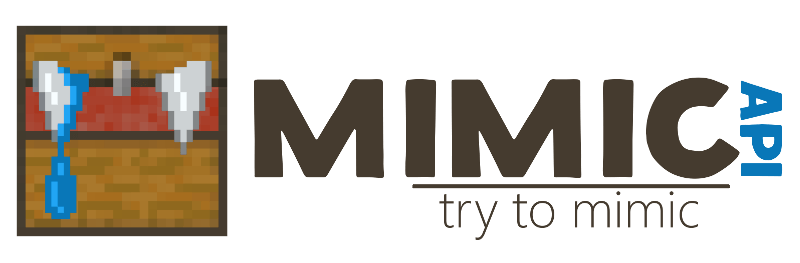

# Mimic
[](https://bintray.com/endlesscode/repo/mimic/_latestVersion) [](https://travis-ci.org/EndlessCodeGroup/MimicAPI) [](https://www.codacy.com/app/EndlessCode-Group/MimicAPI?utm_source%3Dgithub.com%26amp;utm_medium%3Dreferral%26amp;utm_content%3DEndlessCodeGroup/MimicAPI%26amp;utm_campaign%3DBadge_Grade)
[](LICENSE)

[](#)

Abstraction API for RPG plugins.

Other resources:
[SpigotMC](https://www.spigotmc.org/resources/82515/),
[SpigotMC Forum](https://www.spigotmc.org/threads/456931/),
[RuBukkit](http://rubukkit.org/threads/134308/)  
Join us: [](https://discord.gg/5NfPsgb)

## What is MimicAPI?
The goal of MimicAPI is to make RPG plugins compatible with each other.

There is a lot of RPG plugins and to integrate them together you need to get copies of all these plugins (some of which are paid).
Inspired by [Vault], I wrote MimicAPI to avoid this problem.  
With Mimic, you don't need to download all RPG plugins and write specific code for each plugin to support them, just use Mimic as a dependency.

### Available APIs
- [LevelSystem] - API to work with player's level and experience points. Makes it possible to use in plugins levels and exp from another plugin
- [ClassSystem] - API to work with player's classes. Enables plugins to check player class.
- [ItemsRegistry] - API adding the possibility to create and validate custom items created with plugins.

### Implementations

#### Bukkit
- [mimic-bukkit-api](mimic-bukkit-api) - mimic-api adopted for Bukkit. Use it in Bukkit plugins.
- [mimic-bukkit](mimic-bukkit) - Bukkit plugin containing some APIs implementations.
It also provides commands to test your API implementation.
Use it as example of Mimic APIs usage and implementation.

## Installation

If you are server owner, just get needed plugin from [Implementations](#implementations) section.
If you are developer you can use [Gradle] or [Maven] to plug MimicAPI to your plugin.

### Gradle

```kotlin
repositories {
    maven { setUrl("https://dl.bintray.com/endlesscode/repo") }
}

dependencies {
    compileOnly("ru.endlesscode.mimic:mimic-bukkit-api:0.5")
}
```

### Maven
```xml
<repository>
    <id>bintray-endlesscode-repo</id>
    <url>https://dl.bintray.com/endlesscode/repo</url>
</repository>

<dependency>
  <groupId>ru.endlesscode.mimic</groupId>
  <artifactId>mimic-bukkit-api</artifactId>
  <version>0.5</version>
  <scope>provided</scope>
</dependency>
```

## Usage

> Look [Implementations](#implementations) pages for API usage examples on your platform.

## Contributing
Pull requests are welcome.
For major changes, please open an issue first to discuss what you would like to change.

Please make sure to update tests as appropriate.

[Vault]: https://github.com/MilkBowl/Vault
[Gradle]: https://gradle.org/
[Maven]: https://maven.apache.org/

[LevelSystem]: mimic-api/src/main/kotlin/level/LevelSystem.kt
[ClassSystem]: mimic-api/src/main/kotlin/classes/ClassSystem.kt
[ItemsRegistry]: mimic-api/src/main/kotlin/items/ItemsRegistry.kt
